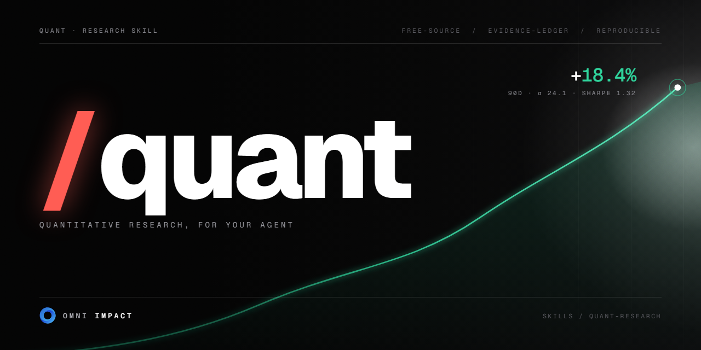

<p align="center">
  
</p>

# /quant

**Quantitative research for your agent.** A free-source, evidence-ledger-backed research
workflow for analyzing stocks, ETFs, crypto, commodities, FX, rates, options, funds, sectors,
catalysts, and portfolios — producing reproducible, cited, decision-support dossiers without
paid data.

<sub>A skill by <b>Omni Impact</b>.</sub>

---

## What it does

`/quant` runs like a skeptical research desk rather than a stock-tip generator. Every material
claim traces to an evidence ledger or a computed artifact, and output is framed as
decision-support — scenarios, proof gates, and monitoring triggers — not buy/sell/hold advice.

- **Evidence-ledger backed** — claims cite primary, regulatory, issuer, and free market sources; gaps are marked and confidence is lowered when data is missing or stale.
- **Reproducible quant** — code-backed statistics, returns, and charts from local price data instead of eyeballing web pages.
- **Living dossiers** — a structured workspace per asset that refresh runs reuse, append to, and version.
- **Scenarios & proof gates** — base / bull / bear paths with explicit invalidation signals and watchlist triggers.
- **Free-source only** — unless you explicitly supply paid data.

## Research depths

| Depth | Scope |
|-------|-------|
| `brief` | Core identity, basic source check, key price/return stats, risks & catalysts, evidence gaps |
| `standard` *(default)* | Full evidence ledger, quant profile, fundamentals, valuation/implied expectations, scenarios, proof gates, monitoring |
| `deep` | Broader source sweep, peers/comparables, richer tests, historical analogs, disagreement analysis, diligence queue |

## Quick start

```bash
# Create a dossier for an asset
python quant-research/scripts/quant_research.py init-dossier --asset NVDA --asset-type equity --root research

# Run reproducible price analysis (CSV with `date` and `close`)
python quant-research/scripts/quant_research.py analyze-prices --prices path/to/prices.csv --out-dir research/NVDA/quant

# Validate the evidence ledger
python quant-research/scripts/quant_research.py validate-ledger --ledger research/NVDA/evidence-ledger.csv
```

See [`quant-research/SKILL.md`](quant-research/SKILL.md) for the full workflow, evidence rules,
and output contract.

## Brand assets

Social / OG card and usage live in [`docs/brand/`](docs/brand/).

---

<sub>Made by <b>Omni Impact</b>.</sub>
